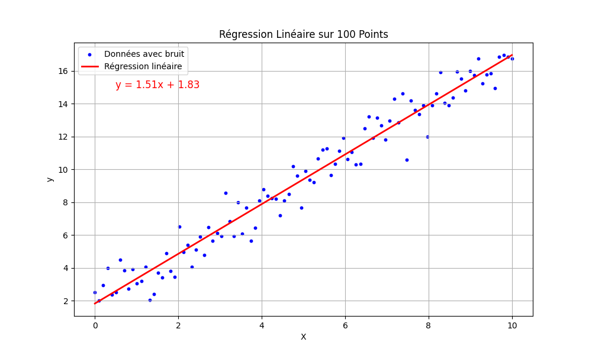
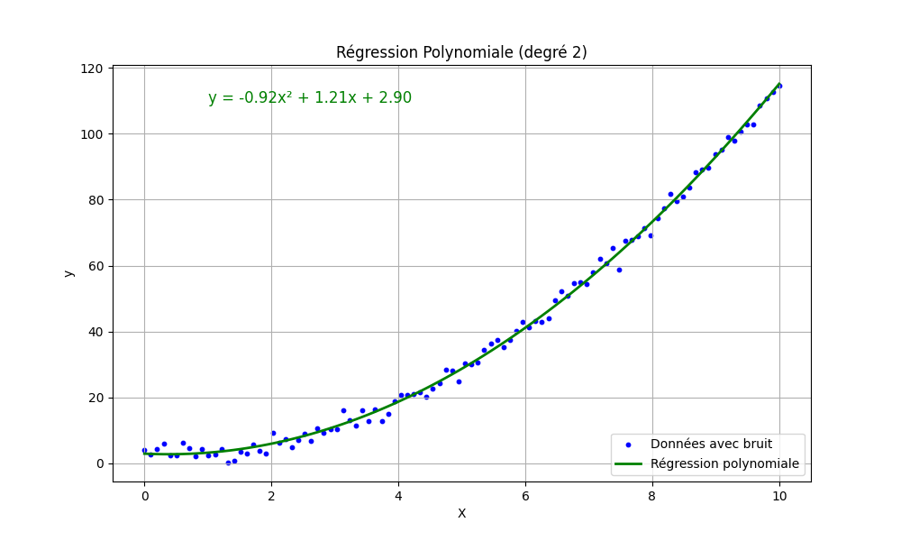
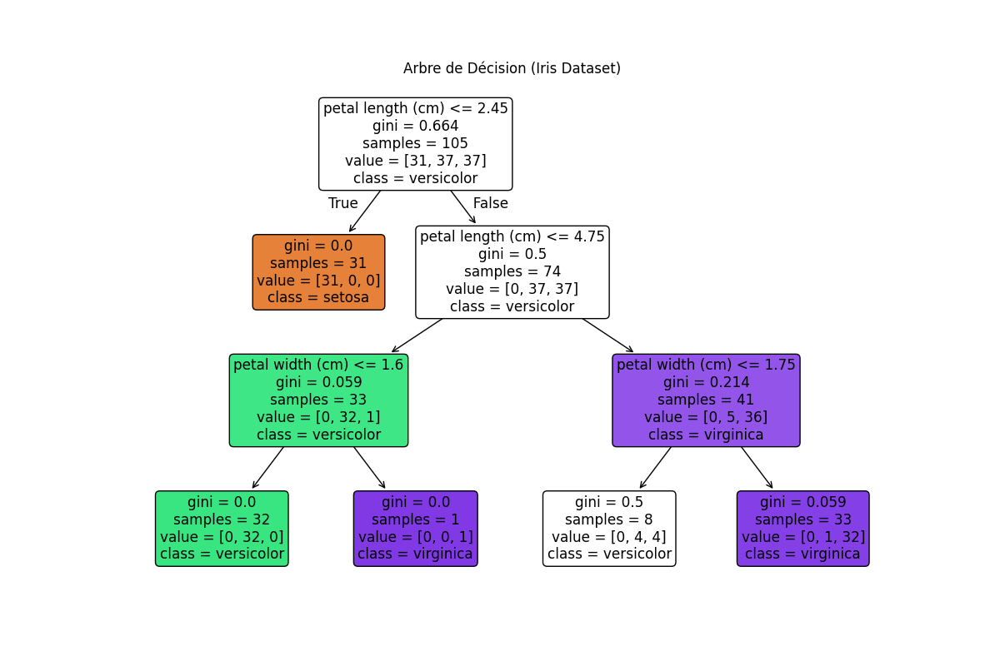

# Projet Machine Learning – Régression & Arbre de Décision (Python)

Ce projet présente trois modèles de machine learning de base codés en Python à l'aide de `scikit-learn` :

1. Régression Linéaire
2. Régression Polynomiale
3. Arbre de Décision

Tous les scripts sont exécutables directement depuis **PyCharm** ou un terminal avec `python`, sans Jupyter Notebook.

---

## 📂 Setup l'environnement

1. Clonez le dépôt :

```bash
git clone git@github.com:dovatgabriel/regression-machine-learning.git
```


2. Accédez au répertoire du projet :

```bash
cd regression-machine-learning
```

3. Activer l'environnement virtuel :

```bash
python3 -m venv .venv
source .venv/bin/activate
```

4. Avant d'exécuter les scripts, assurez-vous d'avoir installé les dépendances :

```bash
pip3 install numpy pandas matplotlib scikit-learn
```

## 📊 Résultats

### Régression Linéaire



### Régression Polynomiale


### Arbre de Décision



### Références

- Régression Linéaire :
    - Scikit-learn - LinearRegression
    - Wikipedia - Régression linéaire
    - Machine Learning Mastery - Linear Regression for Machine Learning

- Régression Polynomiale :
  - Scikit-learn - PolynomialFeatures
  - Medium - Polynomial Regression Explained
  - Wikipedia - Régression polynomiale

- Arbre de Décision :
  - Scikit-learn - DecisionTreeClassifier
  - Wikipedia - Arbre de décision (intelligence artificielle)
  - Towards Data Science - Decision Trees Explained
